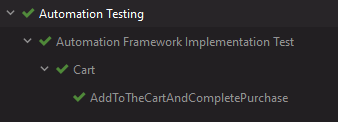
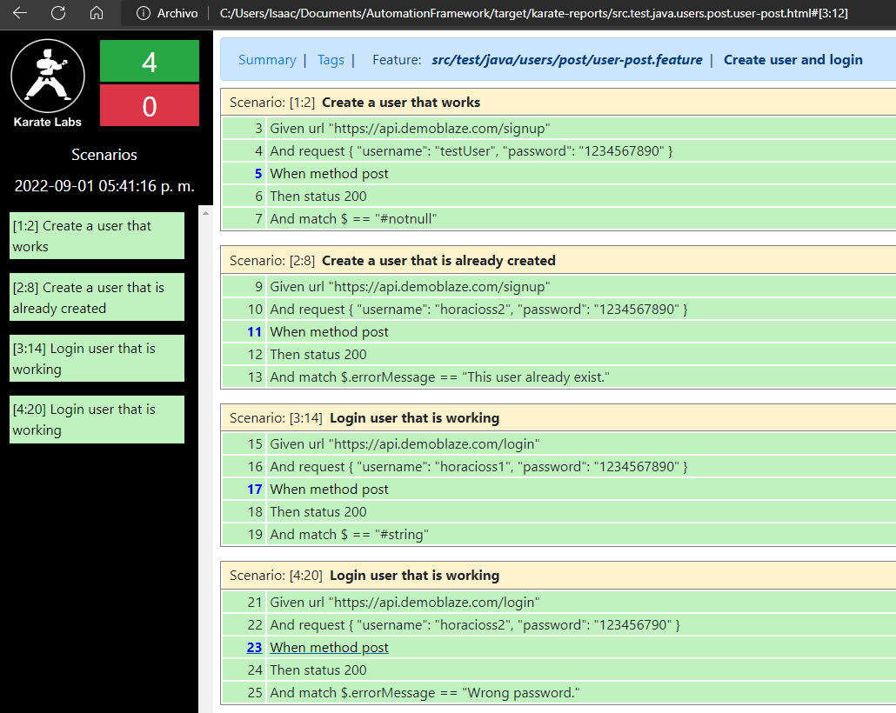

**TC1 -- Add to the cart validation**
1. Go to https://www.demoblaze.com
2. Add 2 products to the cart
3. Visualize the cart
4. Complete the purchase form.
5. Complete the purchase.

**TC2 -- Verify login and create user**
1. Create user successfully
2. Create user that is already created
3. Login user successfully
4. Login user that will fail (wrong password)
   
**Features:**
- Work for different environments and configs (dev/test env) ✅
- Ready to work with Chrome, but also safari ✅
- Ready to work with Windows and Linux ✅
- Screenshot in case the test fail ✅
- Use Page Factory and POM ✅
- Use TestNG or Junit for Java with Selenium ✅ Java
- Use Encapsulation and Inheritance to have a more orderly design ✅
- Apply a naming convention ✅
- Using Karate to test api endpoints ✅

**Tutorial to execute this tests**

**UI testing**
- To execute this test run the StoreCart.xml file. 

**API testing**
- To execute this api test run the user-post.feature file.

